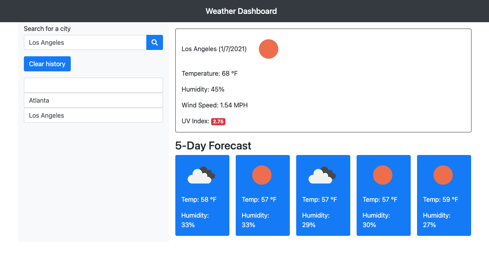

# Weather-Man

This is an app that displays a five day weather forecast based on the user's input of their city of preference. The app shows the current weather for that city in addition to the temperature, humidity, UV index, and an image of the forecast. The search history is saved in the local storage and the user can access it at any time. This history can also be deleted at the user's discretion by clicking the "Clear History" button. If the user refreshes the browser the search history remains and the last city requested will be displayed. 

